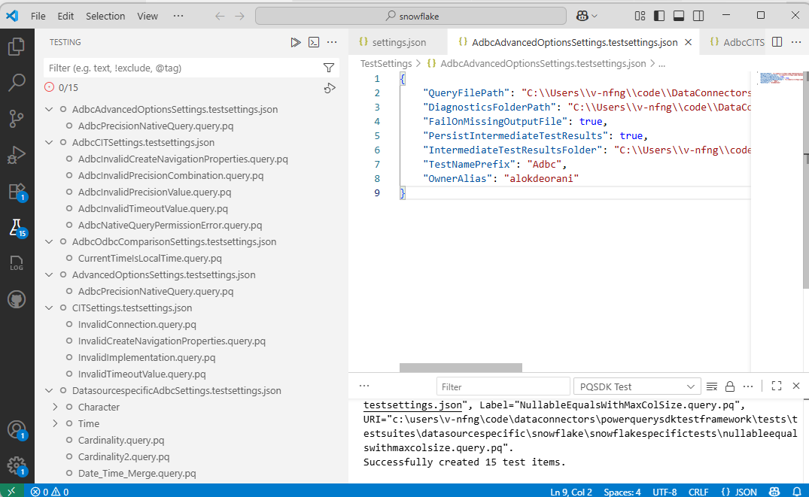
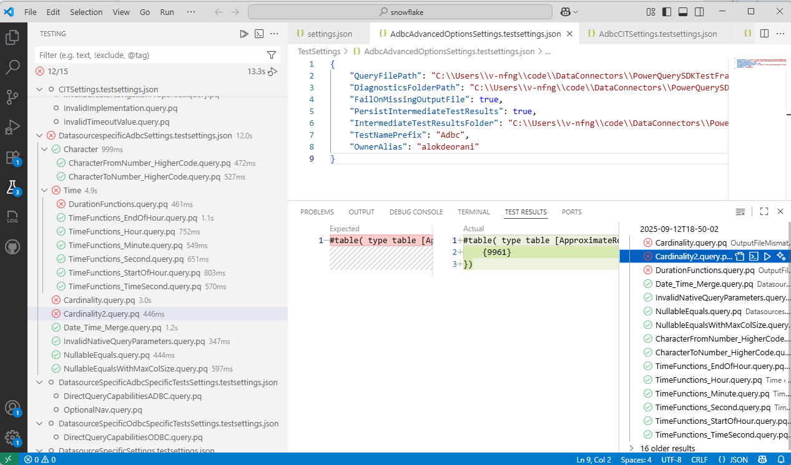
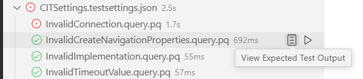
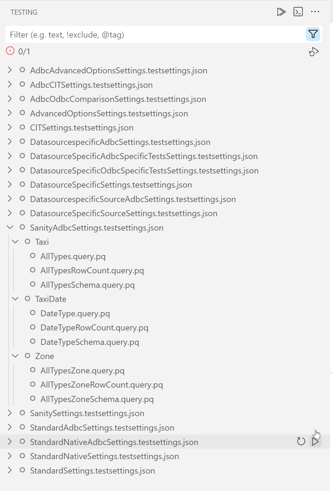
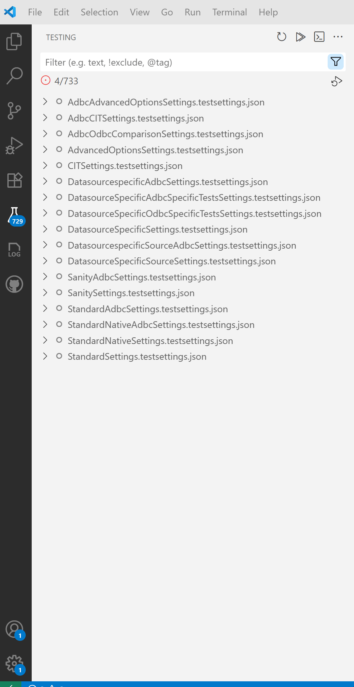

# Power Query SDK - Test Explorer Integration 

The Power Query SDK for Visual Studio Code now includes integrated support for discovering and running Power Query connector tests directly within the VS Code Test Explorer UI.  

### Overview

**With the integrated Test Explorer support, you can:**
- Discover and run Power Query tests directly from the VS Code Test Explorer
- Organize tests using your own folder structure and see that structure mirrored in the Test Explorer
- View real-time test results, including detailed output and diffs for failures
- Filter, group, and run tests at any level (all, folder, or individual test)
- See instant UI updates in the Test Explorer to reflect test settings changes

It uses a test settings file(s)-driven approach, where you define the path to your test files and test run configurations (see the [About `.testsettings.json` (Test Settings File)](#about-testsettingsjson-test-settings-file) for more info). It builds on the native [VS Code Testing API](https://code.visualstudio.com/api/extension-guides/testing) to provide the necessary testing features.

Tests are displayed in the VS Code Test Explorer as “test items”: objects that represent individual tests or groups of tests (Learn more about test items and the VS Code Testing API [here](https://code.visualstudio.com/api/extension-guides/testing).)

*Test Explorer with some sample discovered tests and hierarchical test items.*

*Test Results pane showing detailed output and a side-by-side diff for some sample failed tests.*

## Quick Start

### Prerequisites

- Visual Studio Code version 1.100 or later.
- Enable internal features, run `setx PQTest_MS_Internal_Testing true` in your command prompt and restart VS Code. For more details, see [Enable Microsoft Internal Settings](https://powerbi.visualstudio.com/Power%20Query/_git/DataConnectors?path=/Docs/PowerQuerySDKForVSCode.md&_a=preview&anchor=enable-microsoft-internal-settings).

### Steps

**Tip:** If you already have the Power Query SDK extension installed in your default profile, you can create a new [VS Code profile](https://code.visualstudio.com/docs/configure/profiles) to test this version in isolation without affecting your existing setup.

1. Install the Power Query SDK extension (includes the integrated Test Explorer support) by running `code --install-extension <path_to_vsix>` in your terminal.
2. Make sure your workspace contains one or more `.testsettings.json` files. See [About `.testsettings.json`](#about-testsettingsjson-test-settings-file) for details.
3. Specify the required configurations (see the [Configuration](#configuration) section below).
4. Open the Test Explorer view in VS Code.
5. Expand a test settings item to discover its corresponding tests.
6. Run tests by clicking the Run button at any level (all tests, a test settings group, a folder, or an individual test).
7. View results and output in the Test Explorer and Test Results window.

### Configuration

Set the following configurations in `.vscode/settings.json` file of your workspace (Open Command Palette → "Preferences: Open Workspace Settings (JSON)"):

1. `powerquery.sdk.test.settingsFiles`: Path(s) to your `.testsettings.json` file(s) or a directory containing them. Accepts:
   - A string path to a directory (all valid `.testsettings.json` files inside will be used)
   - A string path to a single test settings file
   - An array of string paths to individual test settings files/directory containing them
2. `powerquery.sdk.test.ExtensionPaths`: Path(s) to your connector file(s) (`.mez` files). Accepts:
   - A string path to a single connector file
   - An array of string paths to multiple connector files
   - Supports VS Code variable substitution (e.g., `${workspaceFolder}`)
   - Relative paths are resolved relative to the workspace folder
   - If not provided or empty, falls back to `powerquery.sdk.defaultExtension` (which only supports a single path)
3. Set up connector credentials as described [here](https://dev.azure.com/powerbi/Power%20Query/_git/PowerQuerySdkTools?path=/Tools/PQTest/pqtest.md&_a=preview&anchor=set-credential).

### About `.testsettings.json` (Test Settings File)

A `.testsettings.json` file is a JSON configuration file that defines how your Power Query connector tests are discovered and run. It follows the same format as the `settings.json` file supported by the PQTest framework, and includes all the options required for a test run (such as test directories, diagnostics folder path, and other settings).

You can create this file manually or by copying and modifying an existing PQTest `settings.json` file. For details on the supported options and structure, see the [PQTest settings file documentation](https://powerbi.visualstudio.com/Power%20Query/_git/PowerQuerySdkTools?path=/Tools/PQTest/pqtest.md&_a=preview&anchor=using-a-settings-file).

**Important:** Paths specified within the `.testsettings.json` file (such as `QueryFilePath`, `DiagnosticsPath`, etc.) are expected to be relative to the location of the settings file itself. This aligns with how PQTest's `run-compare` command resolves paths.

During test execution, this file is passed to PQTest using the `--settingsFile` flag (e.g., `PQTest.exe run-compare --settingsFile <path-to-your-testsettings.json>`).

### How to view expected output file (.pqout) for a test?

Click the "View Expected Test Output" button (clipboard icon) next to a test item (`.query.pq`) in the Test Explorer View. 

*Viewing an expected test output (.pqout) file from VS Code Test Explorer.*

### How to trigger rediscovery of tests for a single settings file?

Click the "Refresh Tests" button (Refresh icon) next to a settings item (`.testsettings.json`) in the Test Explorer View. 

*Rediscovering tests for a sample settings file using the "Refresh Tests" button in the Test Explorer.*

### How to discover tests for all settings files at once?

Click the **Refresh Tests** button (Refresh icon) at the top of the Test Explorer panel. 

*Discovering tests for all settings files using the Refresh Tests button at the top of the Test Explorer.*

### Logging & Troubleshooting

- Extension logs are available in the `Power Query SDK` output channel.

- Common issues:

   - **PQTest.exe not found:** Set `powerquery.test.pqtest` or `powerquery.sdk.tools.location`.
   - **Invalid QueryFilePath:** Ensure `QueryFilePath` in your settings file points to a directory or `.query.pq` file.
   - **No tests found:** Use the internal SDK feed and ensure `QueryFilePath` points to a valid directory.
   - **Expanding a settings file does nothing:** Use the "Discover Tests" command (refresh icon inline with a settings item) to refresh tests.
